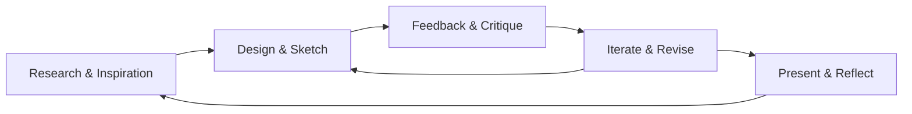

Final projects are the **capstone assignments for each semester**. They are long-term projects that you work on gradually while completing weekly assignments and unit work. These projects showcase your best skills at that point in the program and prepare you for future coursework.

Good final projects are:
- **Planned** — you start early and track progress each week.  
- **Iterative** — you revise based on critique and feedback.  
- **Documented** — you save sketches, drafts, and notes.  
- **Presented** — you explain your work clearly to an audience.  

---

# Semester 1 Final Project

  Character Concept

**Focus**: Visual storytelling and design fundamentals.  

**Task**: Design an original character concept.  
- Research references and inspiration.  
- Sketch character ideas in Krita.  
- Develop a polished concept sheet with front view, side view, and one pose.  
- Include notes on personality, setting, and design choices.  

**Deliverables**:  
- Character concept sheet (digital)  
- Short written explanation of design choices  
- Presentation of character concept to the class  


This project connects to **Unit 3 — Visual Storytelling & Game Design Fundamentals**.  


---

# Semester 2 Final Project

  Character + Prop & Portfolio

**Focus**: 2D/3D workflows and professional presentation.  

**Task**: Expand your Semester 1 character by designing a related prop or accessory.  
Examples: backpack, headphones, sword, hat, staff, gadget, etc.  

Steps:  
- Sketch and refine your prop design  
- Create a simple 3D model of the prop in Blender  
- Present how the prop fits your character’s world and story  

**Deliverables**:  
- Prop design sketches + final concept art  
- Exported 3D model of the prop  
- Short presentation connecting prop and character  


This project connects to **Unit 6 — Professional Skills & Portfolio Development** and includes a **Portfolio Submission**.


---

## Portfolio Requirement

By the end of Semester 2, you will submit a **starter portfolio** that includes:
- Your Semester 1 character concept  
- Your Semester 2 prop design and model  
- Selected weekly assignments that show process and growth  
- A short reflection on your goals moving forward  

The portfolio is **not a one-time assignment**. You will continue to update and refine it throughout the 3-year AME pathway. It becomes the showcase of your work for future classes, college, or job applications.  

---

## Grading & Structure

Final Projects count for **30–40% of the semester grade**.  
They are graded on:  
- **Creativity & Originality** — unique ideas, thoughtful design choices  
- **Technical Skill** — drawing, digital art, or modeling accuracy  
- **Process** — research, sketches, revisions, feedback applied  
- **Presentation** — ability to explain work and connect ideas  
- **Professionalism** — meeting deadlines, following directions, portfolio formatting  


Final Projects are **make-or-break**. Perfect weekly points without a final project can only earn you a **C**. To earn an **A or B**, you must complete and present your Final Project.

